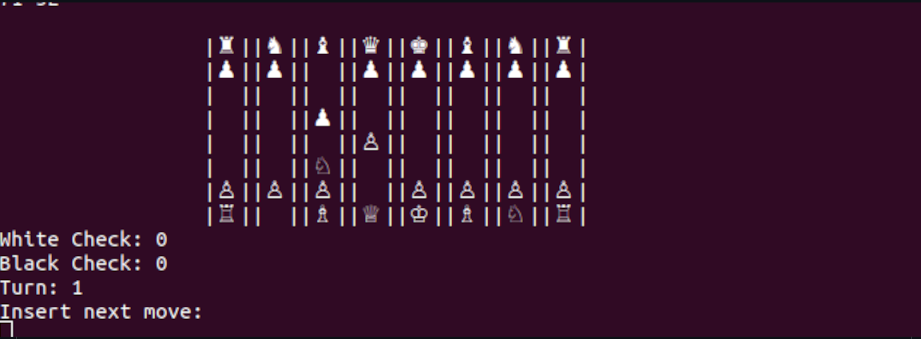

# Multiplayer Chess





### Run multiplayer CHESS:

In order to run multiplayer CHESS, whilst in the terminal, move to the directory /onlineChess inside the downloaded source code.
Once you're there, run the following command
```
make
```
The make command will compile the source code into two different executables, one named "client" and one named "server". If makefile doesn't work, you can copy-paste the following two lines in the terminal to compile the two executables:
```
gcc bishop.c methods.c server3.c movePieces.c printBoard.c tower.c calculateMoves.c king.c queen.c checkmate.c knight.c pawn.c printMenu.c -o server
```
```
gcc bishop.c methods.c client3.c movePieces.c printBoard.c tower.c calculateMoves.c king.c queen.c checkmate.c knight.c pawn.c printMenu.c -o client
```

As the names suggest, the server will have to run the server binary file and the client will have to run the client one. In particular, the server needs to run the server executable and specify the port on which will listen for connections:

```
./server "port number"
```
While the client will have to run the client executable and specify the IP address of the machine where the server process holds, alongside with the port on which said machine is listening

```
./client "ip address" "port number"
```
You are now ready to play online chess in your terminal via TCP/IP socket, enjoy!


### How to move pieces:
As of now, only the following positional convention is supported: any piece on the board is represented by an ordered couple of a lowercase character(a-h) and an integer(1-8) [row,column]: In order to move a piece from a point to another, we use the following syntax:
```
xy x'y'
```
where x is the initial row, y is the inital column, x' is the ending row and y' is the ending column. 
Let's make an example: suppose we have the board
```
			 	 |♜ ||♞ ||♝ ||♛ ||♚ ||♝ ||♞ ||♜ |
			 	 |♟ ︎||♟ ︎||♟ ︎||♟ ︎||♟ ︎||♟ ︎||♟ ︎||♟ ︎|
			 	 |  ||  ||  ||  ||  ||  ||  ||  |
			 	 |  ||  ||  ||  ||  ||  ||  ||  |
			 	 |  ||  ||  ||  ||  ||  ||  ||  |
			 	 |  ||  ||  ||  ||  ||  ||  ||  |
			 	 |♙ ||♙ ||♙ ||♙ ||♙ ||♙ ||♙ ||♙ |
			 	 |♖ ||♘ ||♗ ||♕ ||♔ ||♗ ||♘ ||♖ |
```
and we want to move the 4th black pawn 2 units forwards. As we said earlier, the pawn is univocally determined by a couplet [row,column]. In this case row = 6 because our pawn is a distance of 6 blocks away from the top corner of the board, and the column = 3 because the pawn is at a distance of 3 units from the left corner of the board. To move our piece we will then use the command
```
d2 d4
```
The result of this move will be
```
			 	 |♜ ||♞ ||♝ ||♛ ||♚ ||♝ ||♞ ||♜ |
			 	 |♟ ︎||♟ ︎||♟ ︎||♟ ︎||♟ ︎||♟ ︎||♟ ︎||♟ ︎|
			 	 |  ||  ||  ||  ||  ||  ||  ||  |
			 	 |  ||  ||  ||  ||  ||  ||  ||  |
			 	 |  ||  ||  ||♙ ||  ||  ||  ||  |
			 	 |  ||  ||  ||  ||  ||  ||  ||  |
			 	 |♙ ||♙ ||♙ ||  ||♙ ||♙ ||♙ ||♙ |
			 	 |♖ ||♘ ||♗ ||♕ ||♔ ||♗ ||♘ ||♖ |
```
